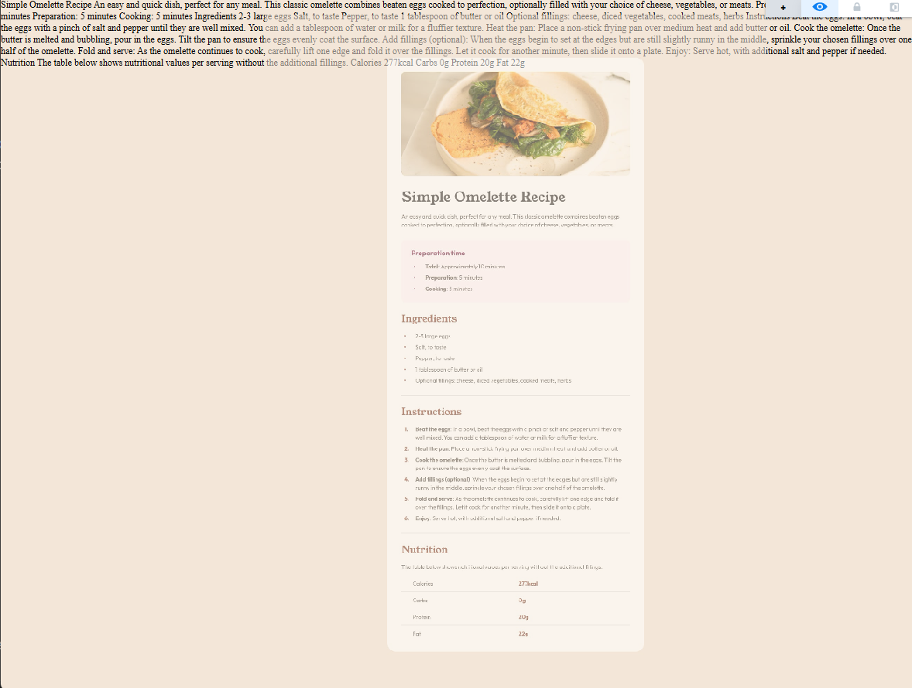
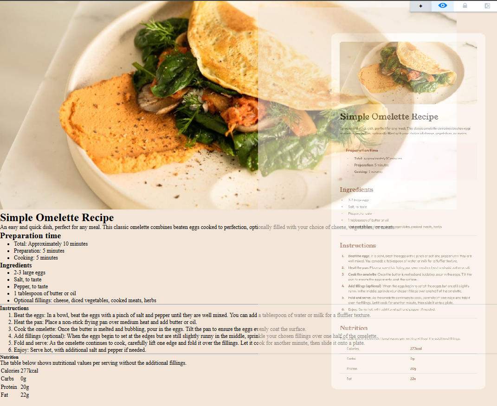
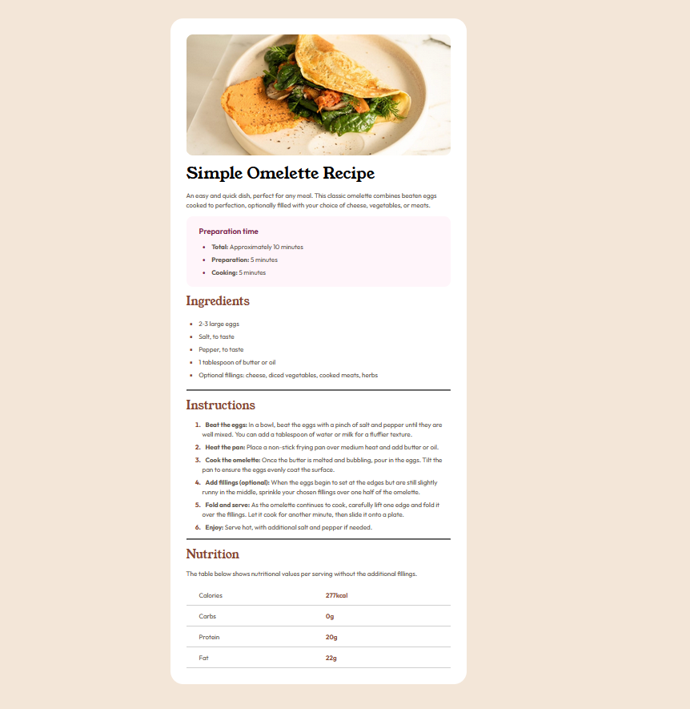

# Frontend Mentor - Recipe page solution

  

This is a solution to the [Recipe page challenge on Frontend Mentor](https://www.frontendmentor.io/challenges/recipe-page-KiTsR8QQKm).

Frontend Mentor challenges help you improve your coding skills by building realistic projects.

  
  
  

## Table of contents

  

- [Overview](#overview)

- [The challenge](#the-challenge)

- [Screenshot](#screenshot)

- [Links](#links)

- [My process](#my-process)

- [The Result](#the-result)

- [Author](#author)

- [Acknowledgments](#acknowledgments)

  

## Overview

  

### The challenge

  

Build out this recipe page and get it looking as close to the design as possible.

  

### Screenshot

  

  

### Links

  

- Solution URL: [GitHub](https://github.com/ProfessoraBianca/RecipePageChallenge)

- Live Site URL: [Recipe Page Challenge Site](https://recipe-page-challenge-gamma.vercel.app/)

  

## My process

> In this project I tried to use the PerfectPixel extension for Chrome.
> It helped a lot but I still have to train using it.

 I started by layering all the HTML content, text and containers for the images. 
 
 
 
 Then I went to CSS and added the background color for the `<body>` and other future elements by using color variables, so it would be easier to use after. I also added the necessary fonts path.
 
 
 
 And so... It was **HELL**. 

>>É de cair o c* da bunda! 1
>
> 1. Famous brazilian expression

I had a lot of problems with this design. 
 (as you can probably see in the .CSS file) 
 
 At first, what appeared to be simple was a hell of a challenge. Like the **lists**: 
 

 - I wasn't capable of making the wraped text to align with the begining of the paragraph.
 - I had difficulty adjusting the line height of the text vs the list + list gap. 
 (but I learned how to do it... maybe?!)
 - The alignment of the markers  (and color of it)  vs text was a very hard thing too.. I did make it but maybe it isn't the best way of doing.
  

> Note: I didn't used some colors offered by Frontend Mentor... Was it my
> fault or there where more colors than needed?

~~Don't even make me metion the table at the bottom~~

  ## The Result

   

### Built with

- Semantic HTML5 markup

- CSS custom properties

- Flexbox

  

## Author

  

- Youtube - [@ProfessoraBianca](https://www.youtube.com/@ProfessoraBianca/)

- Frontend Mentor - [@ProfessoraBianca](https://www.frontendmentor.io/profile/ProfessoraBianca)

  

## Other Challenges Solutions

  

- [QR Code Challenge](https://github.com/ProfessoraBianca/QRcodeChallenge)

- [Blog Card Challenge](https://github.com/ProfessoraBianca/BlogCardChallenge)

- [Social Links Challenge](https://github.com/ProfessoraBianca/SocialLinksChallenge)
